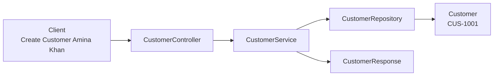

```mermaid
flowchart LR
Client["Client<br/>Create Customer Amina Khan"] --> CTRL["CustomerController"]
CTRL --> SVC["CustomerService"]
SVC --> REPO["CustomerRepository"]
REPO --> ENT["Customer<br/>CUS-1001"]
SVC --> DTO["CustomerResponse"]
```