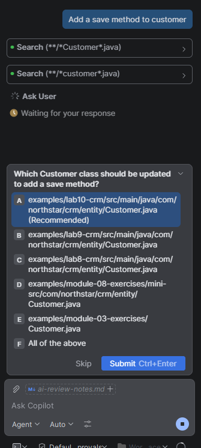
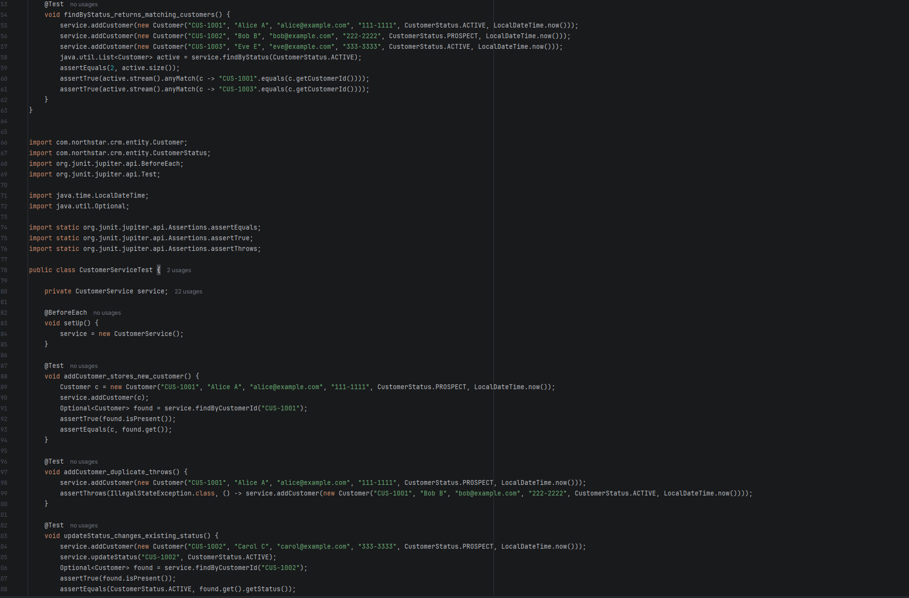
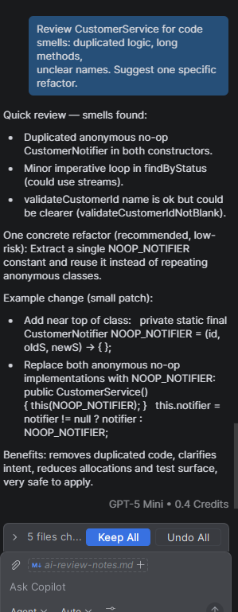
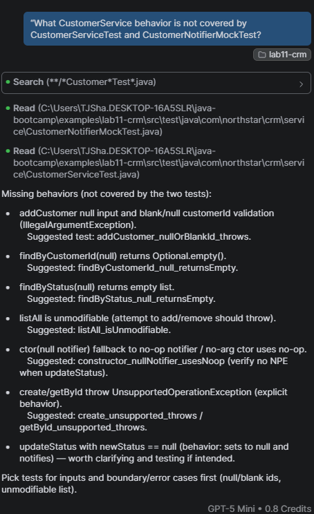

## lab10-001 — weak vs strong (entity)
- Date: 07-28-2026
- Weak prompt used: // customer class
- Output summary: AI reported back sasying that was not enough information
- Strong prompt used:// Java entity class Customer in package com.northstar.crm.entity representing a Northstar CRM customer. Fields: customerId (String, format "CUS-1001"), fullName (String), email (String), phone (String), status (CustomerStatus enum: PROSPECT, ACTIVE, SUSPENDED, CLOSED), createdAt (LocalDateTime). No-args constructor, all-args constructor, getters and setters, equals/hashCode based only on customerId, toString.
- Output summary: A file was created that technically included all that was asked for, however the noargs constructor just ignored every variable and the AI changed the wrong file.
- Decision: accept / reject / partial :Reject
- Reason (1 sentence): The AI changed the wrong file. BE PATH SPECIFIC

## lab10-002 — weak vs strong (addCustomer)
- Date: 07-28-2026
- Weak prompt used: // add customer method
- Output summary: AI reported back saying that was not enough information
- Strong prompt used: // Java method to add a new customer to the system. Should validate the customer data and throw appropriate exceptions if the data is invalid.
- Output summary: A method was created that added a customer to the list, but it didn't include proper validation or error handling.
- Decision: accept / reject / partial :Reject
- Reason (1 sentence): The AI didn't implement proper validation or error handling in the addCustomer method.

## lab10-003 — Checklist for AI-generated code
1. Every import resolves with no phantom spring/JPA imports
2. Business rules are implemented correctly, though input validation is not perfect.
3. equals/hashcodes are based upon customerId only.
4. No hardcoded secrets from AI implementation.

## lab10-004 — AI-Risk Awareness

1. Customer IDs, Names, and other private data was not entered directly into AI chat to prevent that data from leaking
2. You should check that library to ensure that if it does exist you are not plagiarising it and see if you can implement that library instead.
3. If you do not fully understand code that is generated by AI, do not use it. Either attempt to trace what the AI is doing or create your own implementation.

## Failure Experiments

- Adding Delete customer was not an issue for me, though the autocomplete works to save time finishing specific lines of code
- DO NOT send private data to AI chat, it is not secure and you will be responsible for any data leaks.
- If you're using AI for code, do it in smaller amounts so that the code is easier to review.

## Lab10 Discussion

1. Inline completion uses context from the specific line of code to fill in a line, while the AI chat is going to tell you what it is doing. Use inline completion when you are finishing a commented class, and use AI chat when you have specific questions.
2. A vague comment can leave room for interpretation which will often lead to a lacking in features class, while specificity often results in a more accurate implementation from AI.
3. Keeping AI away from customer data is important due to the possibility of data leaks. Never give secrets, always prefer formats to specific examples.
4. By stating the potential states of customers, it allows the AI to create a class that is able to handle customers without looking at any of the customer data.
5. If AI suggests a library that is outside the classpath, you should specify the classpath as well as a business rule that states no outside libraries should be used.
6. Suggestions from AI may compile, but they may not be the optimal solutions. For example, the AI may implement adding two strings together where string concatenation would be much faster.
7. As stated before, using real customer data is a security risk that opens up data leaks.
8. The risk is that the code may be pulled from a closed project, opening the developer up to plagiarism, it is important to check that multi-lined code is not ripped from a separate project you did not create.
9. If Copilot was a runtime dependency, it could gain access to secrets that open any distributed code to security risks.
10. Generating tests can be sped up by using AI to complete lines as well as ask for general possible failure paths to ensure that the code is properly tested.

## lab11-001 — weak test prompt

Prompt used: Create one more test to CustomerServiceTest

Result: 

The AI actually generated a useful test for filtering customers by status, but it also exhibited weird behavior where it added the same file to the end of the CustomerServiceTest.java file, which is not a valid Java file. The test itself was useful, but the AI's behavior was unexpected and could lead to confusion.

## lab11-002 — Code Smells Prompt

Changes: Rejected\
Reason: The AI suggested replacing the no-op notifiers, but lacked to realize that tho no-op notifiers it was talking about were meant to be notes for future developers.

## lab11-003 — Gap Coverage

| Method                                   | Coverage         | Notes                                                                                        |
|------------------------------------------|------------------|----------------------------------------------------------------------------------------------|
| Customer.equals()                        | Not Covered      | Replace equals assertion with tue assertion using equals()                                   |
| Customer.hashCode()                      | Not Covered      | Test DNE                                                                                     |
| Customer.toString()                      | Partial Coverage | Test only verifies that string exists and contains ID, does not test edge cases              |
| CustomerService.addCustomer()            | Partial Coverage | Test only verifies that customer is added, does not test edge cases or invalid input         |
| CustomerService.findCustomerById()     p | Partial Coverage | Test only verifies that customer is found, does not test edge cases or invalid input         |
| CustomerService.findByStatus()           | Covered          | tests the method, could expand test for all cases though                                     |
| CustomerService.updateCustomerStatus()   | Partial Coverage | Test only verifies that status is updated, does not test edge cases or invalid input         |
| CustomerService.listAll()                | Covered          | Method is teseted but does not verify the correct information, only that information exists. |

## lab11-004 — Acceptance Guidelines

Acceptance guidelines for AI-generated tests and refactors:
1. Every assertion must be able to fail — if I can't describe an input that
   breaks it, it isn't a real test.
2. Every refactor must be backed by a passing test suite run before and after.
3. No accepted suggestion may introduce a dependency not already in pom.xml.
4. I can explain, without re-reading Copilot's explanation, why the code
   is correct.
5. Coverage gaps are documented, not silently ignored.