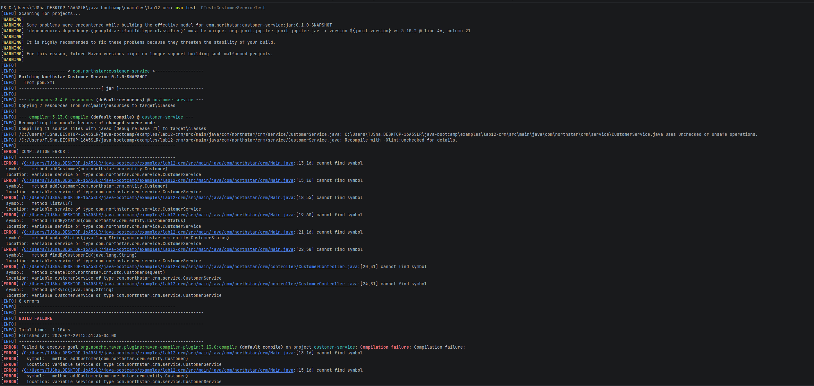
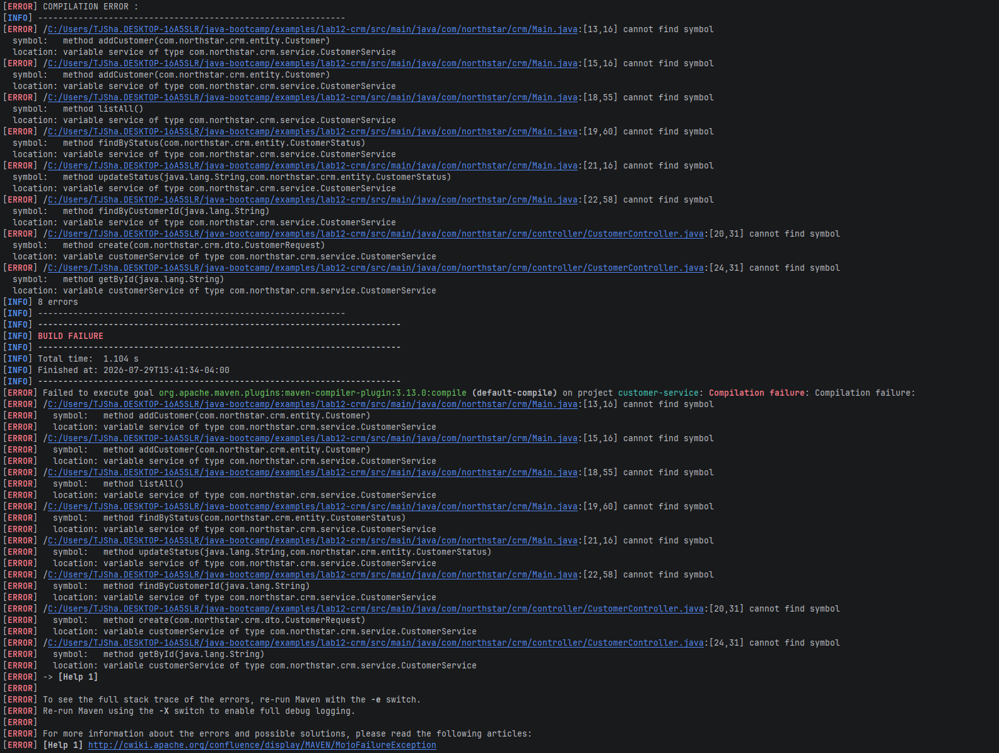

## Before

## After

## Smell Fixes
| Smell | Example in baseline | Solution |
| ----- | ------------------- | ----|
| Poor naming | `doStuff`, `data`, `a/b/c` | Specified Variable names|
| Raw types | `List data` | Hold specific dataTypes (Hashmap)|
| Long method / mixed responsibilities | create + update jammed together | Seperate Responsibilities by method (Input validation, customer handling operations, etc|
| Stringly-typed status | `e.equals("ACTIVE")` chains | Use Polymorphism to check instead of strings |
| Incorrect equality | `==` for String IDs | Utilize .equals and Objeects utility|
| Null as control flow | return `null` on errors | Throw Errors for Testing |
| Side-effect logging | `System.out.println` | Log Errors through maven |
| Magic behavior | name containing `"UPDATE"` triggers update | No Magic operations, clearly deefined methods|
m