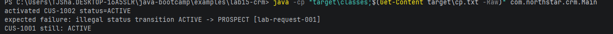

## Allowed Transitions

PROSPECT  -> ACTIVE, CLOSED
ACTIVE    -> SUSPENDED, CLOSED
SUSPENDED -> ACTIVE, CLOSED
CLOSED    -> (none)

## Compile Evidence

## Failure Experiments

1. With a consistent throw statement, the repository will consistently fail, similar to TODO stubs.
2. Both will fail due to the validator checking which status transitions are valid.
3. First status change will succed, but the second will fail due to the validator.
4. With two different repos, there are two different object instances and so duplicate IDs and emails will not be recognized.
5. Setting the state before validation can cause a corrupt state where the transition has been happened but then the error gets thrown.