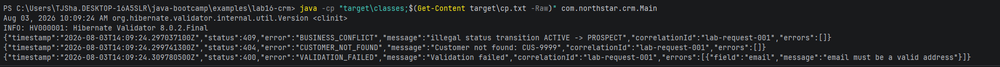

# Lab 16 Notes

## Compilation proof

## Failure Experiments

1. With a basic RunTimeException, the error status is simply a 500 based error, which gives very little information.
2. Both errors get printed together, so error handling gets combined.
3. Two seperate instances of CustomerNotFound get recorded, showing that request have their own error logs.
4. Exception becomes a 500 error indicating that there is a server error when there is really a client error.
5. Putting the stack trace in the error log can cause a security risk of leaking sensitive data.