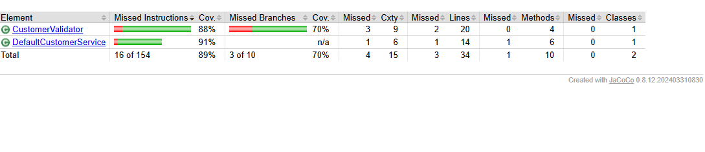
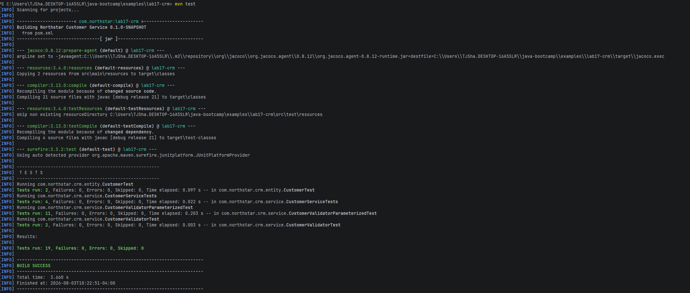
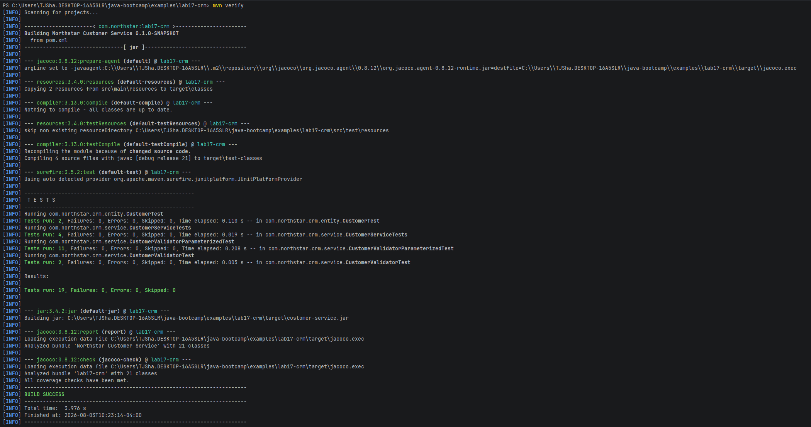

# Coverage Proof

We hit over 80% as I had hoped for, and have tested all but 1 method.

## Runbook

## Failure Experiments

1. All tests fail with nullpointer errors as service is never defined.
2. If I expect the illegal transition to succeed, the tests return with failures.
3. Running the tests twice in a row returns the exact same results as expected.
4. Raising coverage minimum to 0.99 causes the tests to fail as we have not covered every single line of code.

