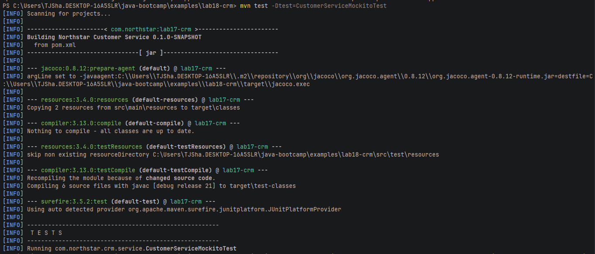
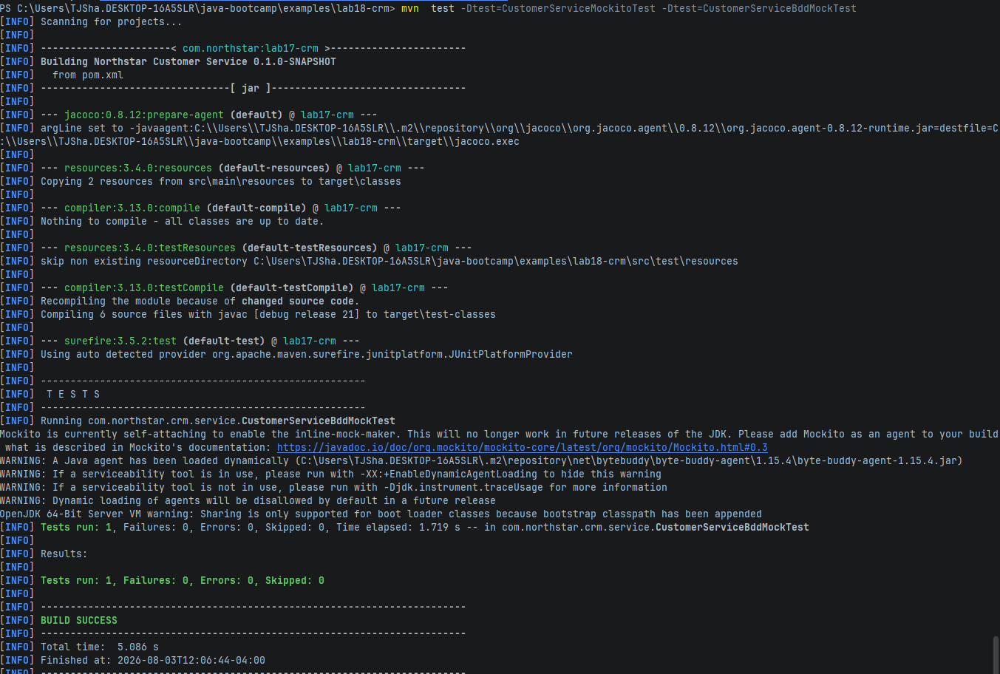

## Test Verification

## Failure Experiments

1. Setting the findById stub to throw a RunTimeException causes an error path from the service to the handler, which removes the isolation from the Mockito test.
2. An exception is thrown due to the validator, conflicts with never().save.
3. Verification failer due to calling service twice without a reset when one call was expected. Refresh objects in @BeforeEach to avoid this.