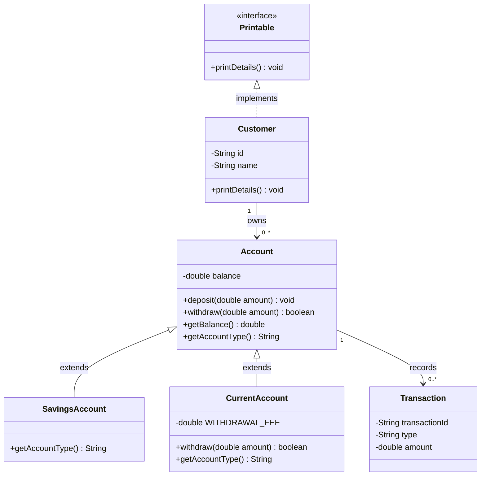

# Banking mini UML

```mermaid
classDiagram
    class Printable {
        <<interface>>
        +printDetails() void
    }

    class Customer {
        -String id
        -String name
        +printDetails() void
    }

    class Account {
        -double balance
        +deposit(double amount) void
        +withdraw(double amount) boolean
        +getBalance() double
        +getAccountType() String
    }

    class SavingsAccount {
        +getAccountType() String
    }

    class CurrentAccount {
        -double WITHDRAWAL_FEE
        +withdraw(double amount) boolean
        +getAccountType() String
    }

    class Transaction {
        -String transactionId
        -String type
        -double amount
    }

    Printable <|.. Customer : implements
    Account <|-- SavingsAccount : extends
    Account <|-- CurrentAccount : extends
    Customer "1" --> "0..*" Account : owns
    Account "1" --> "0..*" Transaction : records
```

- Inheritance: Savings and Current Accounts inherit from the Account Class
- Interface: Customer should have access to printDetails functionality.