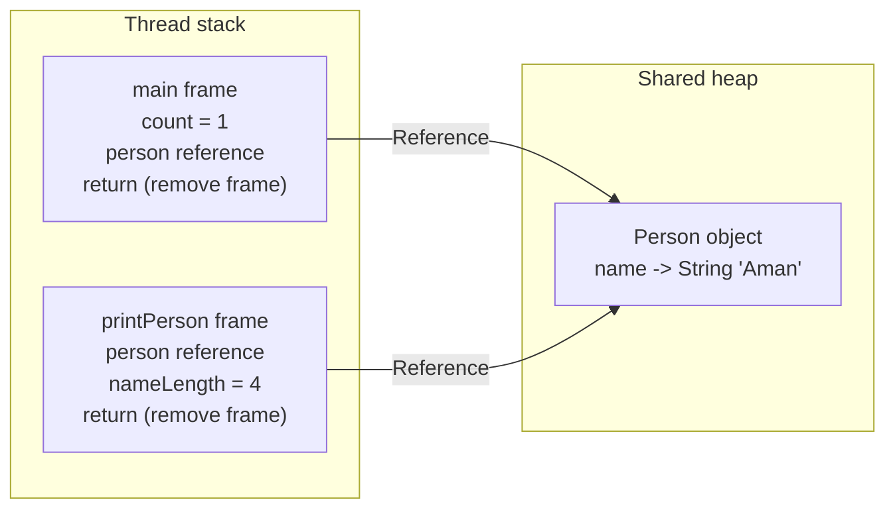

# Module 4 Notes

## StackHeapDemo Trace

## Object Lifecycle Notes

While the `==` operator won't specifically verify that every variable within the object is the same, it will still verify that the objects are the same by comparing the references to each other.
An object is not collectible merely because one reference becomes null.
It becomes GC-eligible only when no live strong-reference path can reach it.
Eligibility does not guarantee immediate collection, and System.gc() is only
a request.

Personal Note: While Garbage Collection prevents memory leaks that would be possible in other languages, it also prevents extreme forms of optimization, **only create objects when necessary** to prevent a pileup of too many objects in memory. For larger projects, writing to file and referencing file may solve some memory issues, but creates security risk.

## Observed Garbage Collection

The Program Only Needed to allocate approximately 50 MB for the program over 20 rounds, however without the limiter the program Allocated approximately 184MB.
I've noticed the step in which Memory is freed is likely through the Pause Remark and Pause Cleanup, where I'm guessing that the Bytes that were allocated but hold no references
were removed. There also Seems to be a G1 Evacuation event for when the memory grows too large and space needs to be cleared, though I am unsure of what it specifically does.
The exact pause times were different for each event, but never exceeded 5.1 milliseconds. Overall Execution took 0.08 seconds.

## G1 Verification Noteese

Command:
java -XX:UseG1GC -Xms16m -Xmx64m -Xlog:gc GcObserve

Evidence:
[0.006s][info][gc] Using G1
[0.028s][info][gc] GC(0) Pause Young (Normal) (G1 Evacuation Pause) 7M->7M(16M) 1.570ms
Log shows use of G1 as well as the G1 Processes, The collector flag is what selects G1, does not guarantee an exact execution or pause time.

## ZGC Verification notes

Command:\
java -XX:+UseZGC -Xms16m -Xmx64m -Xlog:gc GcObserve

Evidence:\
The lgos began with "Using Z Garbage Collector" instead of  "Using G1", there were overall less logs, showing that the GC was working concurrently.\
The evidence for this is the lack of evacuation pause events.

## Leak Sketch Notes

loaded RetentionDemo class\
→ static CACHE field\
→ ArrayList entries\
→ byte[] objects\

Root cause: a long-lived static collection retained strong references after
the data was no longer needed. GC could not reclaim reachable entries.

Fix: clear/remove entries, bound the cache, apply eviction, or use a more
appropriate lifecycle. Weak references are not a universal cache fix.

## String Builder Comparison

| Run | String ms | StringBuilder ms |
| --- |-----------|------------------|
| 1 | 150.27    | 1.60             |
| 2 | 149.29    | 1.43             |
| 3 | 152.08    | 1.61             |

Whenever you simply use the '+' symbol, the string remains readable in memory, so for small adjustments you should used a fixed argument inside a String Builder Function.
