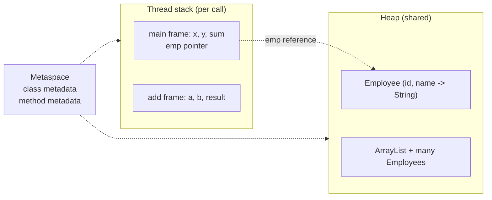

# Lab 1 Notes

## HelloWorld.java vs. HelloWorld.class

The HelloWorld.java is the source code that was written by me and is readable to humans, whereas the\
HelloWorld.class file is bytecode that is meant to be interpreted by the JVM during execution so that it may\
be converted into machine code for execution.

## Calculator Memory Reference

| Source Code Element                                     | Memory Location                  |
|---------------------------------------------------------|----------------------------------|
| Local variables `x` `y` `sum` in `main`                 | `main`'s local Stack frame       |
| Parameters `a` `b` and local variable `result` in `add` | `add`'s Stack frame              |
| Call `add(x, y)` in `main` method                       | Create new Stack frame for `add` |
| Class metadata for `Calculator`                         | Metaspace for references         |
| Temporary `String` for `"sum = " + sum`                 | Heap (dynamically allocated)     |

In the Calculator class, almost every variable is defined locally and not as an obejct reference, \
meaning that those variables can be stored inside of the local stacks for each of their respective methods\
The only dynamic allocation of memory in the bytecode is found with invokedynamic, where memory is allocated\
for the String cocatenation of `"Sum = "` and the `sum` variable. Because strings can vary in size, the `String`\
variable type gets stored in the heap. It is helpful to think of strings as an array of characters, and arrays\
are often stored as pointers to an array object.

## Employee Memory Location

In memory, objects are stored by reference inside of the stack, which then gets passed through by reference\
to the heap when retrieving data from the object. Each method call gets its own stack, which gets referenced by\
invokevirtual in the bytecode. Heap memory gets called to by the new keyword which is also used in the bytecode,\
with the reference being created from new and then dup is able to replicate this reference and store it.

## MemoryDemo Heap Sizes and Garabge Collection

| size_t InitialHeapSize | 524288000  | {product} {ergonomic}    |
|------------------------|------------|--------------------------|
| size_t MaxHeapSize     | 8355053568 | {product} {ergonomic}    |
| size_t SoftMaxHeapSize | 8355053568 | {manageable} {ergonomic} |
| bool UseG1GC           | true       | {prodcut} {ergonomic}    |

## Security and Production Review Answers

1. Because bytecode itself is not human readable, there may be certain vulnerabilities or errors that could appear that would be more easily caught in human-readable form.
2. If a customer's private information sits in memory, that information could then become accessible to outside users who are able to backdoor their way into reading the program's memory, causing a data leak.
3. Passwords and Access keys are meant to be kept private, and printing that information creates a reference to that data that can then be accessed creating a security risk.
4. Without proper bytecode verifications, an external .class retainer could be called to, where if it's from an outside source it could call to code not written by the developer, which could cause a massive security risk.
5. This can quickly cause `OOM` errors when you need code that requires scalability, so it's important to understand what sort of memory is being used and where it is being allocated to.
6. Garbage Collection from login attempts, Access key timeouts, and Admin vs. Regular User privileges.

