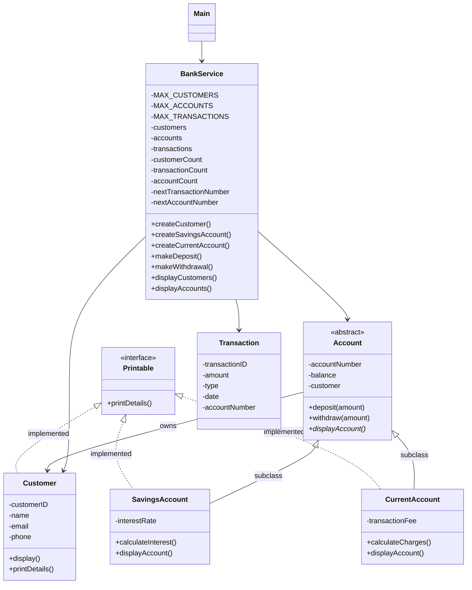

# Banking Service Notes

## SOLID self review
- SRP: Each class was designed with one function in mind, BankService handles inputs, accounts handle their own transactions, and the main class handles the primary execution.
- OCP: Each subclass that was added did not require the old classes to be edited, in this case those subclasses being the different account types.
- LSP: By making the abstract `Account` class, w were able to store all accounts in an array instead of requiring different arrays for different accounts, allowing us to use the necessary account types where needed.
- ISP: The `printDetails` method ended up being used for implementation in the children of the `Account` class while remaining unimplemented in the `Account` class, as well as used for the `Customer` class.
- DIP: The menu in `Main` uses the `BankServices` system instead of relying on itself, allowing us to simply swap out `BankServices` instead of completely needing to rewrite the `Main` class if we want to make changes.

## BankService UML

