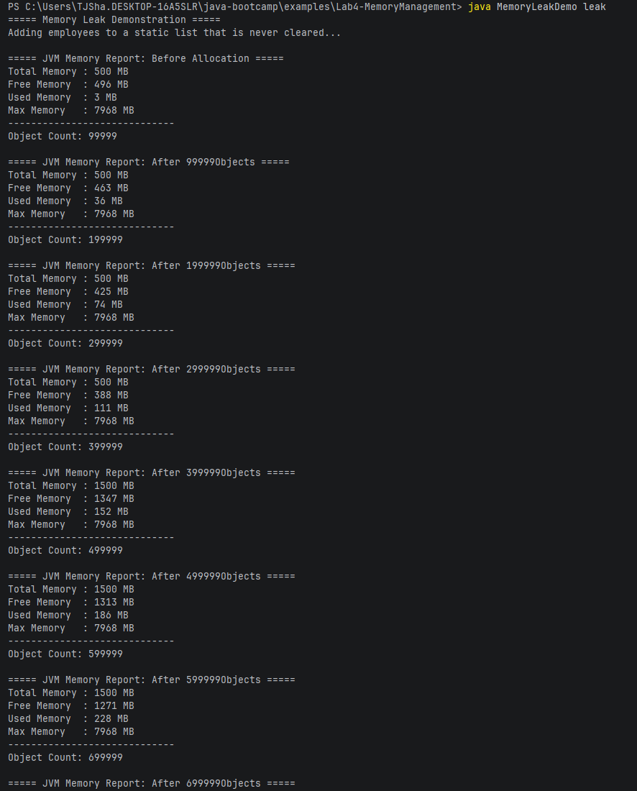
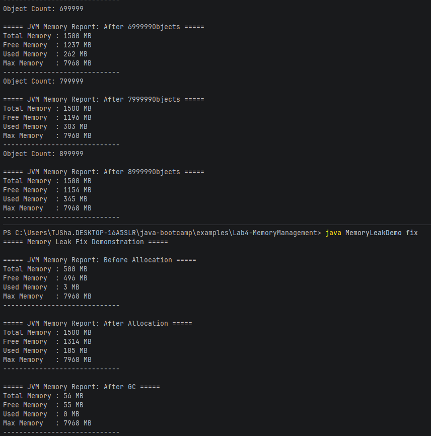
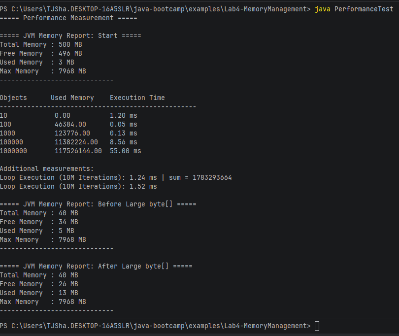
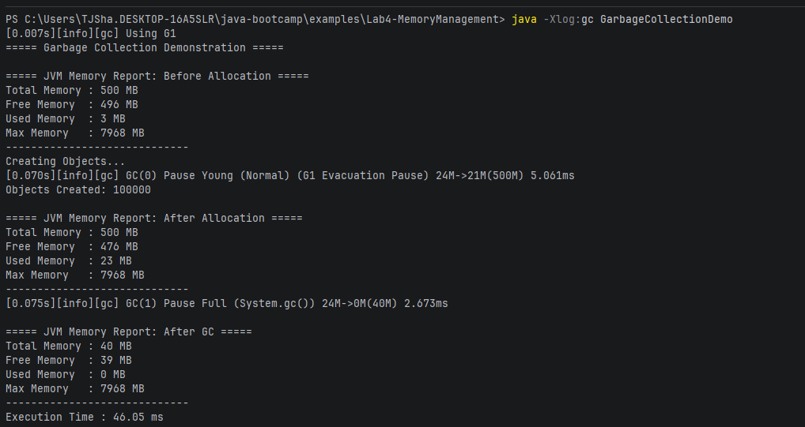

# Lab 4 Notes

## Memory Leak Report

The primary difference between the memory leak version and the fixed version is
that the array in the memory leaked version gets stored in a static field, meaning it goes 
onto the heap, while in the fixed version the array never leaves the heap and is therefore easy
to remove from memory via garbace collection.

## Performance Table

## Garbage Collector Log

