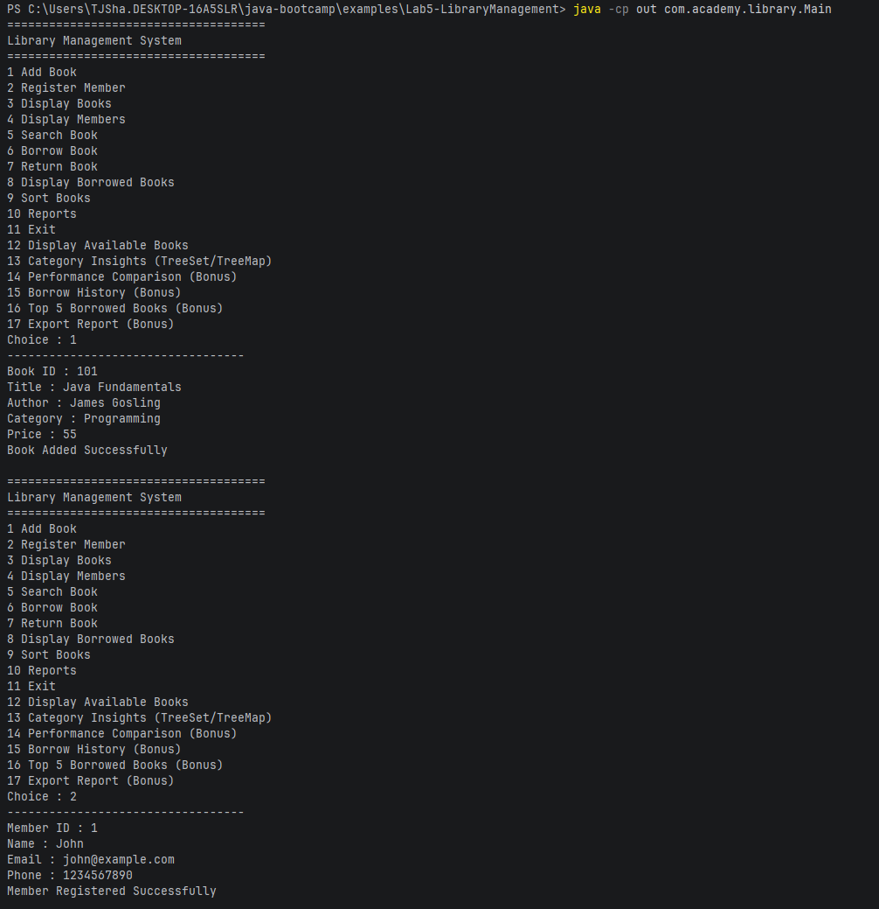
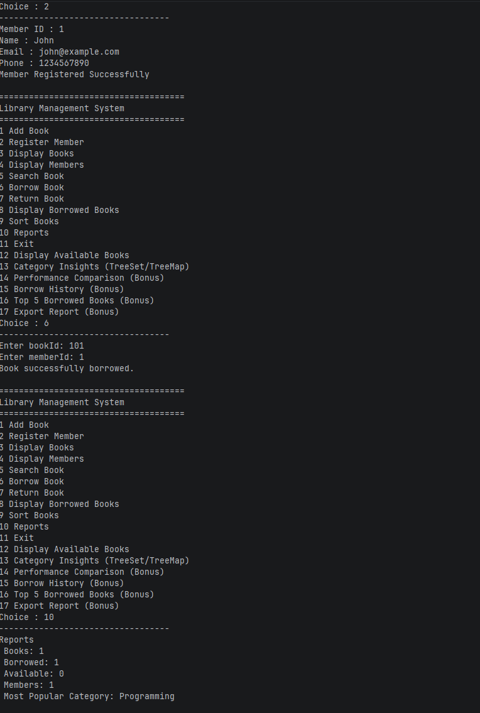
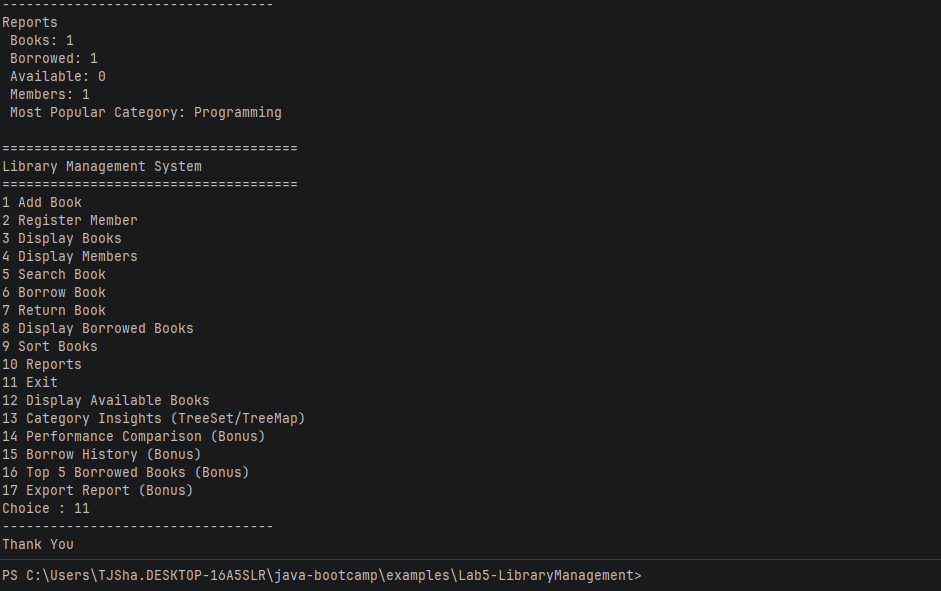
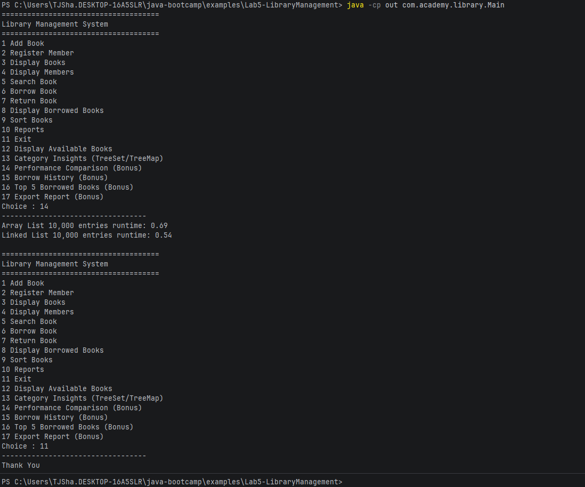

# Library Service Notes

## Execution Proof

## Performance Test Proof

## Field Mapping

- books and members Are both Linked Lists, though perhaps members should be a hashset since each member should be unique
- bookIds and memberIds are both hashsets since we know that there can't be duplicates
- categories is a tree set since we want the categories to be sorted for the menu
- category book count is a tree set since we want it sorted and there is a category key with a book number value
- borrowHistory is an arrayList, though a linkedList might make more sense if you want to keep track of the borrowHistory's order
- borrowFrequency and borrowRecords are each hash maps since each key has identifiable values that correspond with them.

I overall think that the corresponding fields have been properly mapped for their purposes, especially the tree map for\
category popularity and how it's implemented since you only need to pull the last entry to know the most popular category.\
If there was one mapping I would change it would be changing the members list into a hash set since you don't want people setting\
up multiple accounts as the same person or with the same ID.

