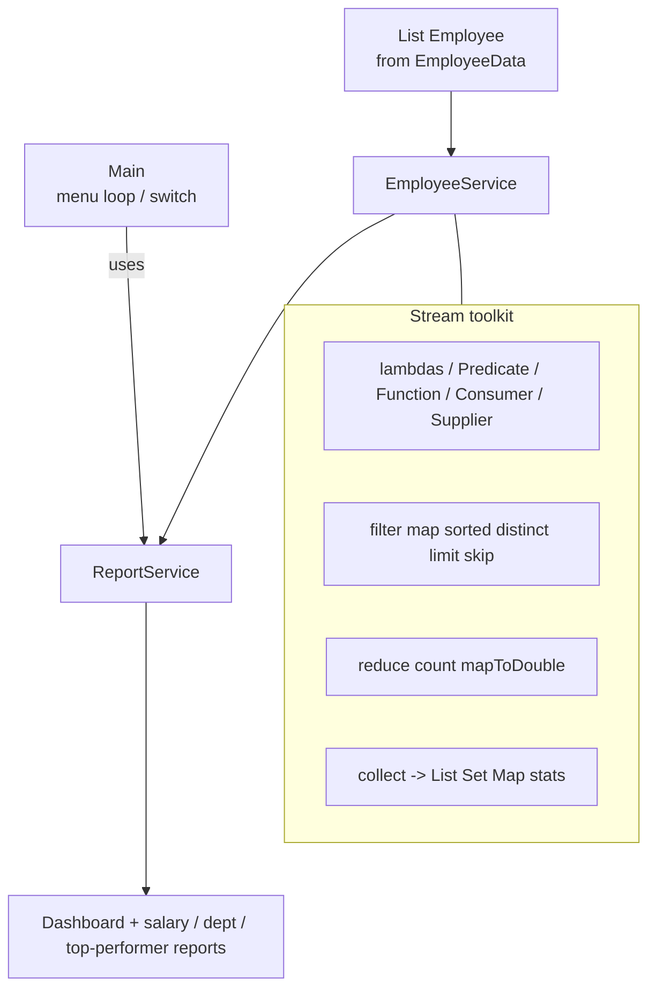
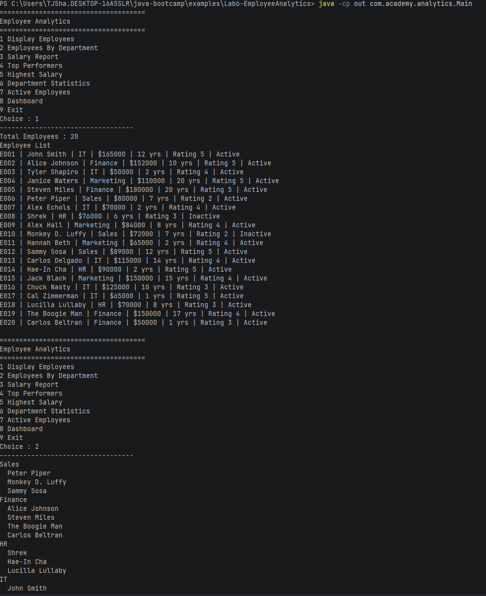
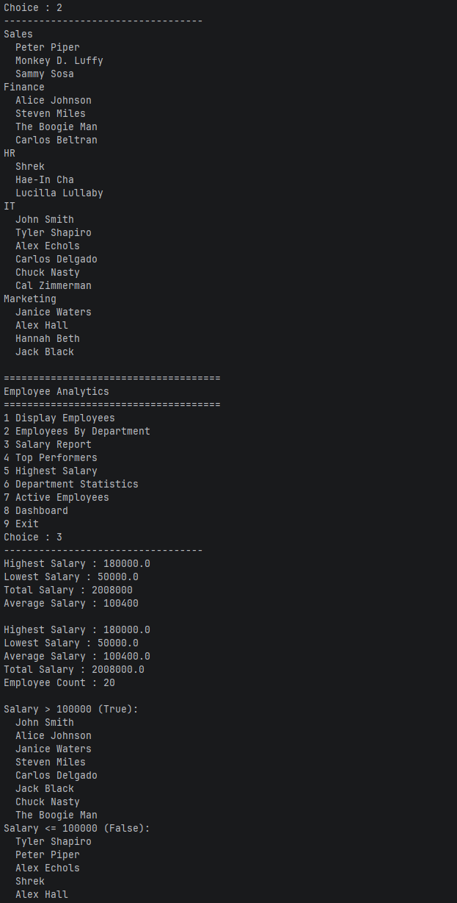
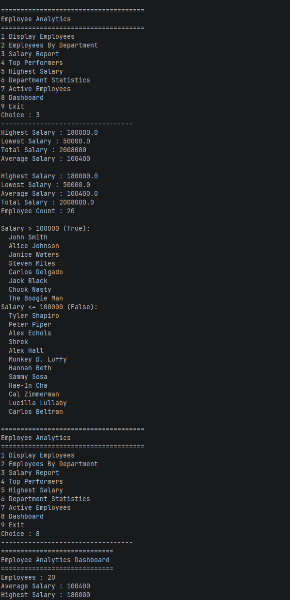
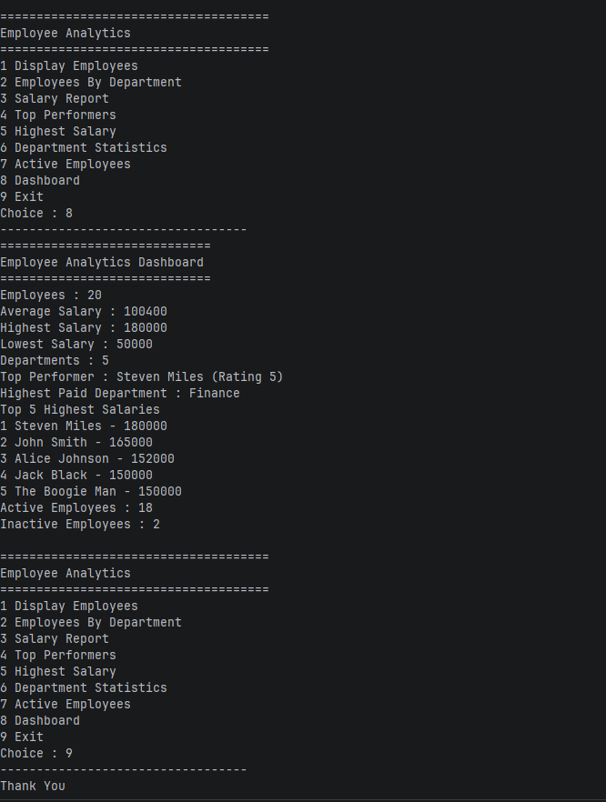

# Salary Stream Lab

## Stream flowchart

## Execution Proof

## Self Reflection Notes

1. Streams tend to be more readable than loops and are designed for ease of implementation. The simple line of commands makes simple arithmetic sequencing make sense during implementation as well. Streams are also safe for multithreaded processes and are great for larger data-sets
2. Streams should be used when working with large datasets and when consistency is needed across multiple APIs.
3. `filter()` is used to choice specific elements from an object, while `map()` is used to apply a function to each element of an object.
4. `reduce()` is useful whenever you want an aggregate result from a stream of data. You can create a sum of the data or return the maximum value of a set, the point is you want one element from a stream of data.
5. `Collectors.groupingBy()` is used when you want to group the elements of a stream of data by a specific condition, be it by a length of a string, or objects that have an enumerator that needs grouped into which element of the enumerator is stored in that object.
6. `Optimal` is useful for when you are unsure of the data that is being passed through, it is mostly used to prevent a type throw exception for if you are trying to group data by a specific variable type that does not exist within the sream of data.
7. Lambda expressions are much closer to mathematical operations than normal code may be. It is very similar to statements made in discrete mathematics where you want to organize a set or make a statement about a set as opposed to in regular code whre you might see more iteratives and branch statements.
8. You should only usee method references when you are calling to an existing method without any need of additional logic. For example, if an object was storing height in millimeters, and you needed to get that you could make a reference, but if you wanted the height converted into meters then you should not use a method reference.
9. Terminal stream operations are often the final operations used to actually collect the string into another object. for example, `.toList()` is a terminal operation that puts the stream into an ArrayList, `.forEach()` is a terminal operation that executes a functino on each element that is in a collection, and `.count()` returns the number of elements that is in a stream.
10. Streams make enterprise applications reliable and scalable with large data sets, especially since those stream operations are typically safe no matter what dataset you may be working with.
11. You could use these stream operators to group customers into categories of loan users, savings account owners, and investment account owners when you need to send out a message to a specific type of c ustomer. 
