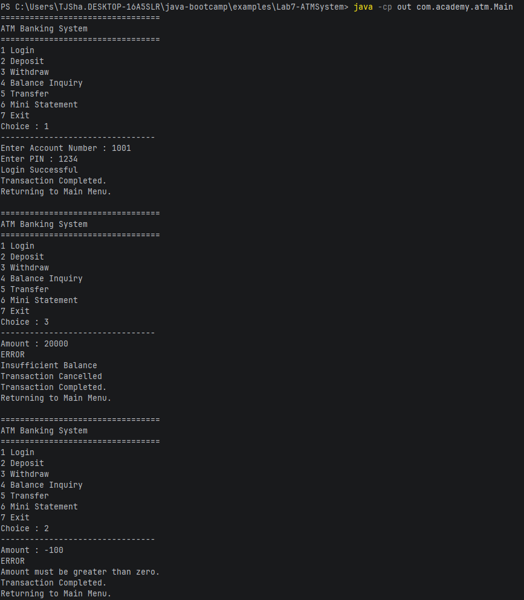
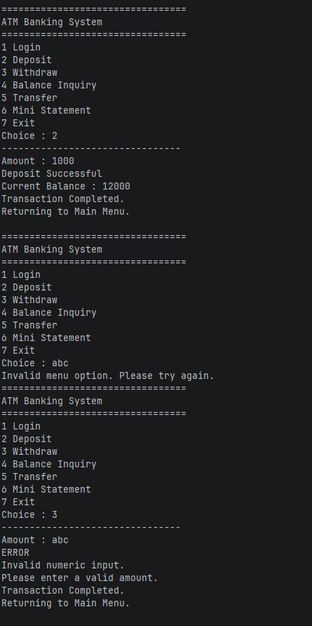
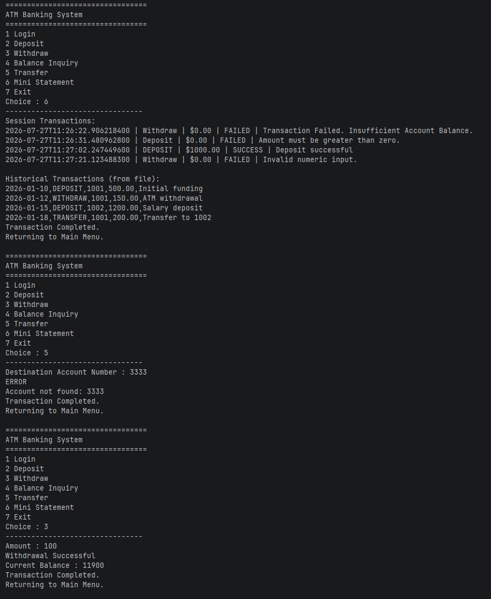
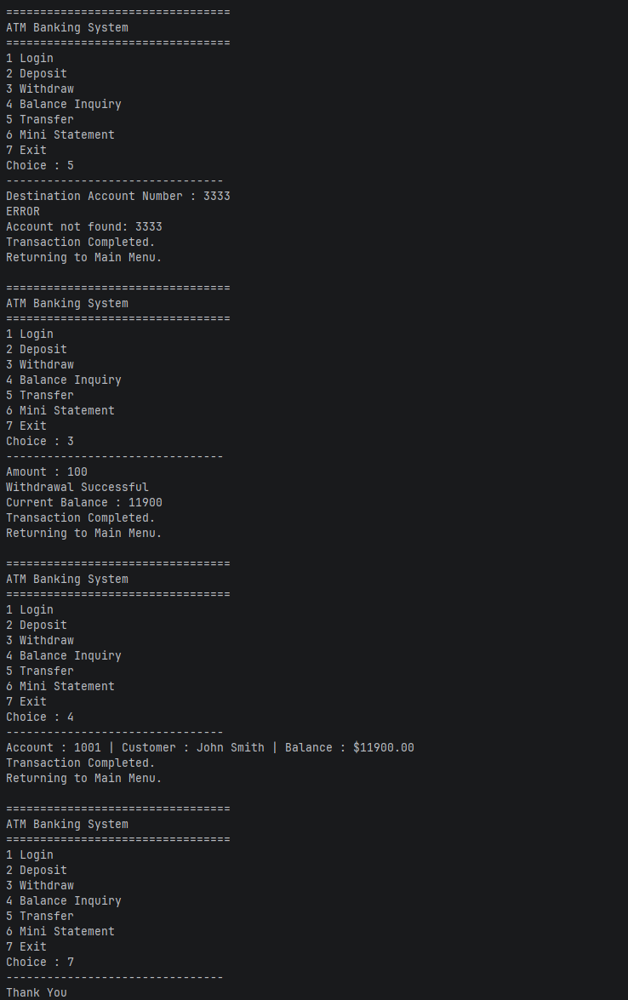
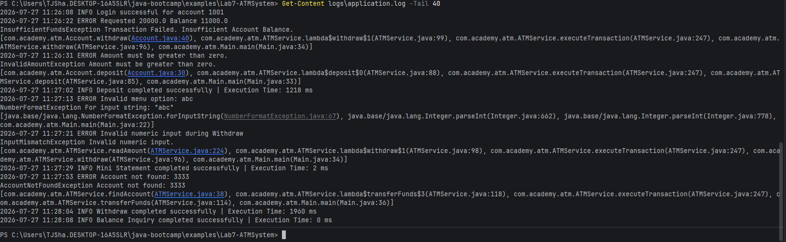

# ATMService Notes

## Execution Proof

## Application Log

## Reflection Questions

1. Checked Exceptions are exceptions that are required to be handled and are checked during compilation, while unchecked exceptions will pass through compilation but can still cause complication during runtime, such as arithmetic errors or null pointers.
2. Custom Exceptions are good for making your code more expressive and maintainable, so that when an error occurs you can be very specific about what the error is or where and when the error is occuring.
3. Exception Propogation is the act of passing an exception through the stack, so exceptions may be passed through multiple methods.
4. Finally is used to execute a block of code no matter the result of a try block. It is mostly used to ensure that resources that are used are returned to the pc and/or are closed.
5. Try-with-resources allows java to automatically close resources whereas finally is manually implemented.
6. Throw should be used when there is a chance for an error that you want to handle and record when it happens.
7. Throws should be used when there are multiple exceptions that could be thrown from a method. Throws should be handled upon method call and not within the method.
8. Logging is important because it allows for action to be taken upon errors that are thrown, so that whoever is trying to fix an error can properly understand where the error is happening.
9. If an exception is not handled, the program will immediately crash and throw the error to the console along with the stack call that caused the exception.
10. Proper Exception Handling makes debugging trivial since you should in theory know exactly where and what errors are being thrown.
11. In production, proper exception handling can inform customers of what is going wrong if something is going wrong so that the customer can remain informed, especially if there is an error the customer can do something about.

