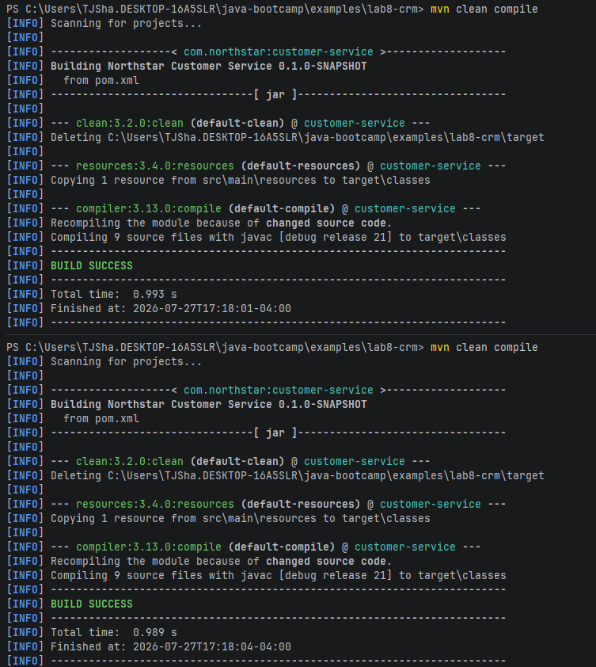

# Lab 8 Notes

## Discussion Concepts

1. Create Customer Flow: Main -> CustomerController -> CustomerService -> CustomerRequest
2. Each Layer has a specific purpose while being able to work alone and not affect another file if edited. Input validation would likely be done by the CustomerController since it's the one that is handling controls for the customer.
3. Success Path: Main -> CustomerController -> CuustomerService -> CustomerRepository -> Customer\
Fail Path: Main -> CustomerController -> CustomerService -> CustomerNotFoundException
4. The Customer ID `CUS-1001` should be a safe way of searching for a customer since there should only be one unique customer ID per customer, while the name of a customer can match the name of another.
5. Writing Data multiple times can ensure data consistency, and using multiple checks is a good way of counteracting network timeouts or ambiguous states
6. In local development, access to data is as simple as checking a file while when working with repositories you are making external calls to databases, meaning that you can be unsure of the streams that you recieve when making those calls, meaning you need to account for what data you might be pulling.
7. 

## Layer Hierarchy

| Layer concept | Package folder | Owns | Must NOT own |
| ------------- | -------------- | ---- | ------------ |
| Presentation | `controller` | Accept/return DTOs; map calls | SQL, business rules |
| Business | `service` | Rules, orchestration | HTTP headers, JDBC details |
| Persistence | `repository` | Save/find | REST mapping |
| Domain | `entity` | Customer fields | Request JSON shapes |
| Contracts | `dto` | Request/response | Persistence annotations (later JPA stays on entity) |
| Cross-cutting | `config`, `exception` | Wiring, failure types | Happy-path create logic |

controller -> service -> repository -> entity\
controller -> dto\
service    -> dto, entity, exception\
repository -> entity\
entity     -> (nothing in other CRM layers)\
config     -> (wiring only; later may reference beans)

## Failure Experiment Notes

1. IntelliJ Literally would not let me rename `pom.xml`, so I am unsure of what would happen, but I can assume that maven would throw a compiler error since there would not be a proper project configuration.
2. Build output was a failure as Main file should not be able to call directly to the repository, should leave those calls to the service.
3. Build works properly with same output twice in a row:

4. While this technically compiles, this breaks the layer hierarchy and creates potential for a call loop: repository -> controller -> service -> repository
5. My `.java` file was missing from the targets folder in the maven compilation due to it breaking the project structure.
