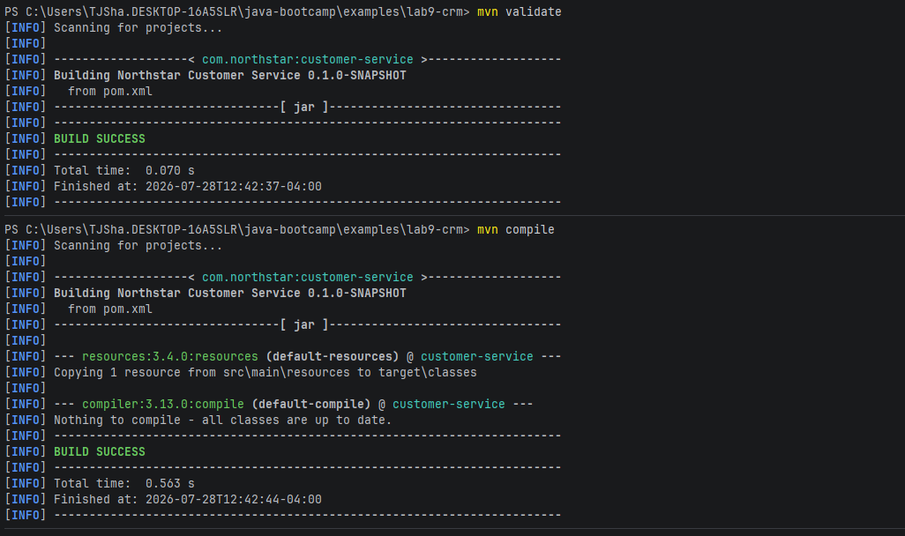
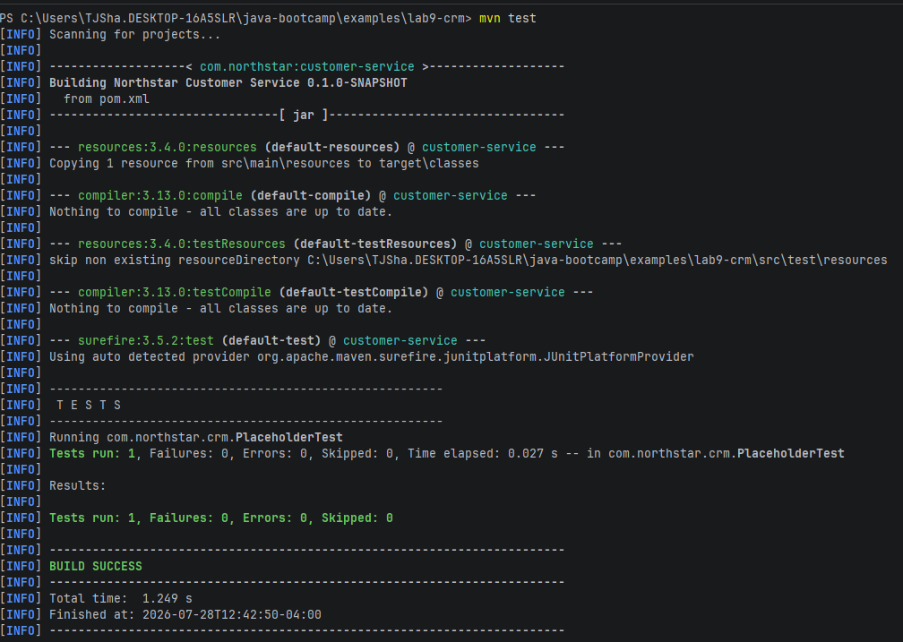
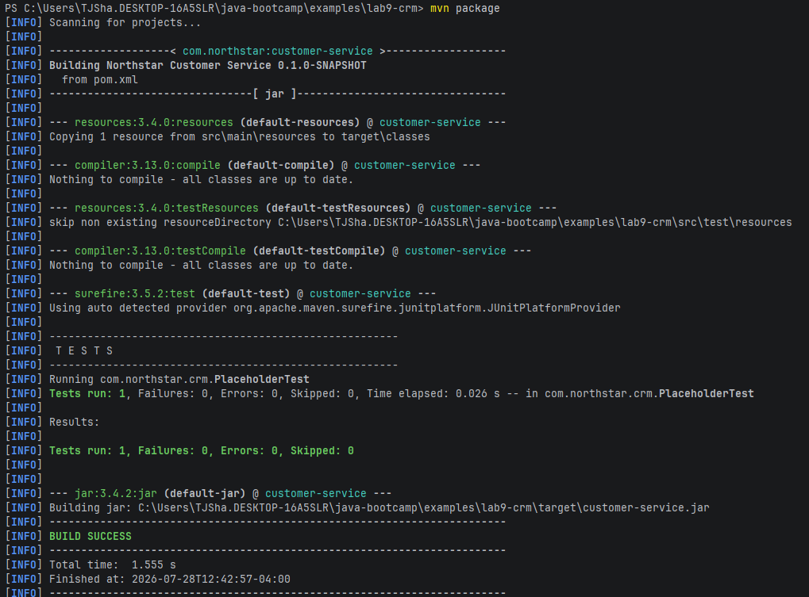
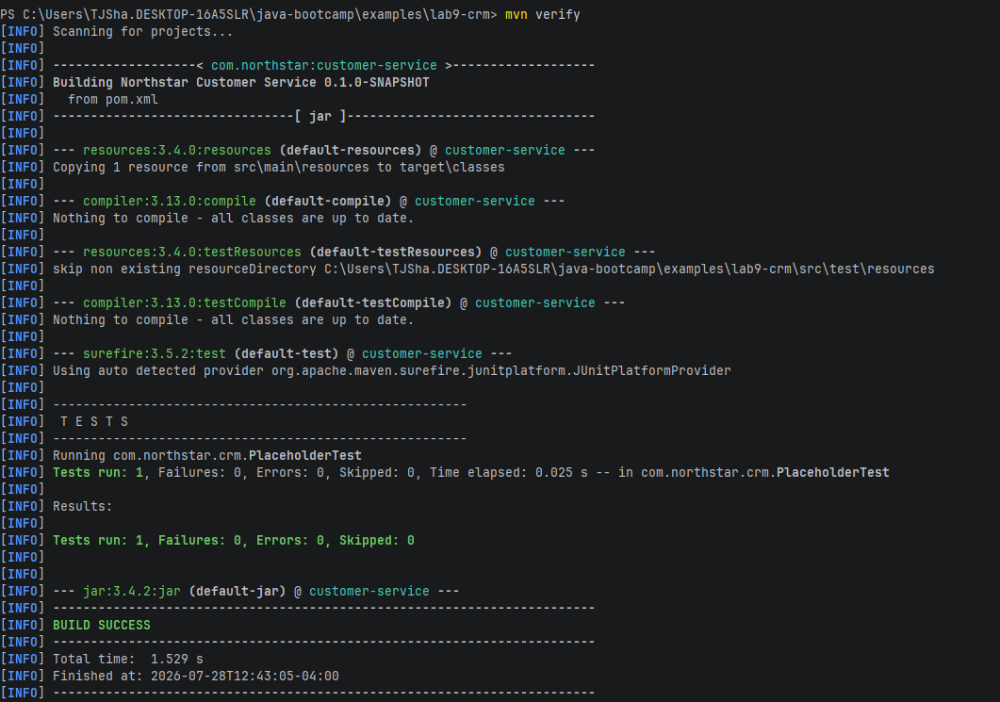
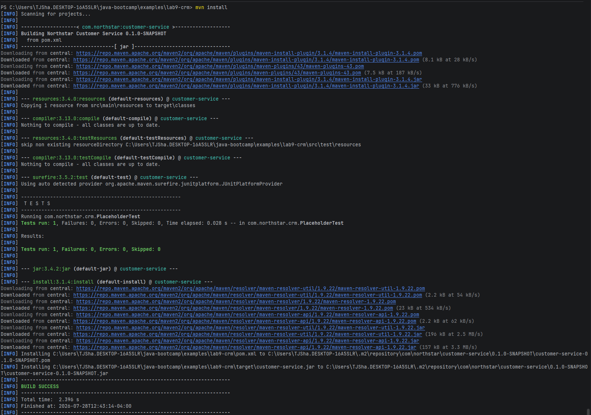
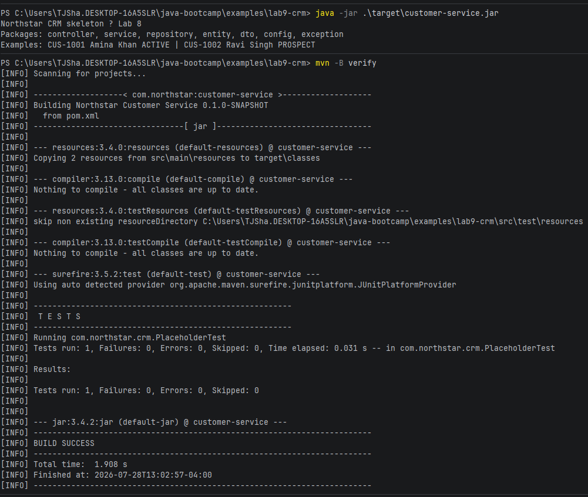

# Lab 09 Notes

## Execution Proof

## Build Proof

## Answers

1. Changing the dependency definitely messed with the current build the most as maven failed to compile or package the program.
2. Setting the spring dependency to nonsense would have been the most difficult to resolve since it lies within the pom, I will need to double check that my dependencies are correct inside of the maven files so that I won't waste time finding errored ones during verification.
3. The biggeset piece of evidence for proving that the walk was real was the test phase, where once I changed the unit test to false, it affected the testing phase of the cycle.
4. The biggest break would be the organization of the project, so ensure that you are not rewriting dependencies that are transitive of other dependencies to keep a clean pom.
5. artifact repository should move to shared infrastructure since the CI cache should be localized to each machine, whereas the repository is a shared resource.
6. customer data should not be pushed to the dev profile and should remain protected.
7. It shows why the Project Structure matters, as maven can heavily rely on the project structure when determining dependencies as well as project coordinates.
8. surefire test and testcompile matter the most as those tend to be where it is easiest to see what errors occur and how they might be fixable.
9. The test scope makes it so that JUnit is not deployed on production ready software, cleaning up the jar dilverables for when a customer would be installing the package.
10. The Dependencies are already in place for springboot, however the project structure itself is likely to change as adding that framework could create different packages.